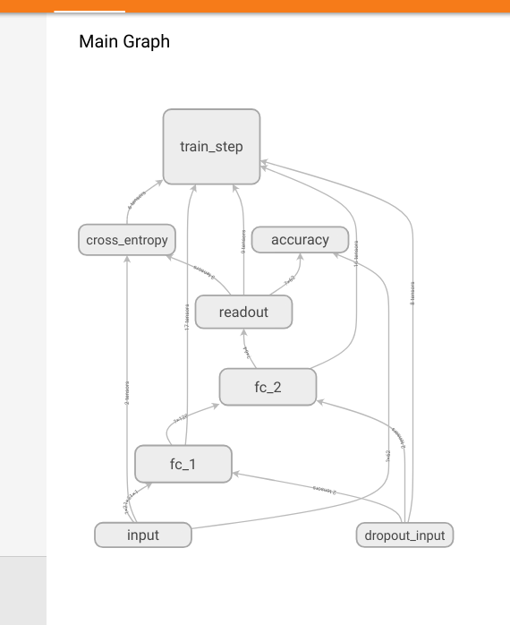
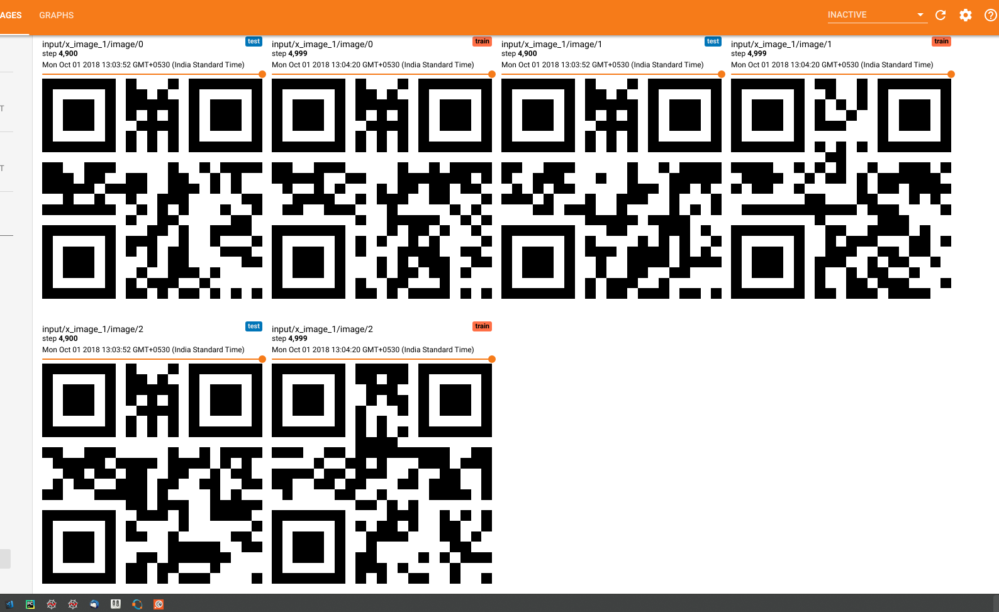

# QR code decryption with tensorflow

### Blog Post: [http://kuldeepsinghsidhu.blogspot.com](http://kuldeepsinghsidhu.blogspot.com)


A simple neural network that predicts the first character that is stored in a
[QR-code](https://de.wikipedia.org/wiki/QR-Code) such as this:


At training time, QR codes are created randomly from alphanumeric strings
of length ten (`sample` in the example above). The validation set also
contains *5000* randomly generated QR codes.

## SetUp

```
virtualenv -p python3 venv --no-site-packages
source venv/bin/activate
pip3 list
pip3 install -r requirements.txt
```

> Using Python 3.5+

## Training

To start the training, simply call:
``` bash
python train.py
```



Then, you can run `tensorboard` to view the test-set accuracy:
``` bash
tensorboard --logdir /tmp/qrnet-log --reload_interval 5
```

### Generated QR codes



## Results

After approximately *50.000* iterations (with *200* QR codes per batch), it
reaches a test-set accuracy of over *0.999*.

[1] Note that there are *(2 × 26 + 10)^10 ≈ 10^18* possible QR codes, so
chances of collisions between the training and the test set are vanishingly
small.

[2] Unfortunately, the online training is rather slow. Most of the time is
actually spent in the (parallelized) QR code generation.


## CREDITS

>Kuldeep Singh Sidhu

Github: [github/singhsidhukuldeep](https://github.com/singhsidhukuldeep)
`https://github.com/singhsidhukuldeep`

Website: [Kuldeep Singh Sidhu (Website)](http://kuldeepsinghsidhu.com)
`http://kuldeepsinghsidhu.com`

LinkedIn: [Kuldeep Singh Sidhu (LinkedIn)](https://www.linkedin.com/in/singhsidhukuldeep/)
`https://www.linkedin.com/in/singhsidhukuldeep/`
